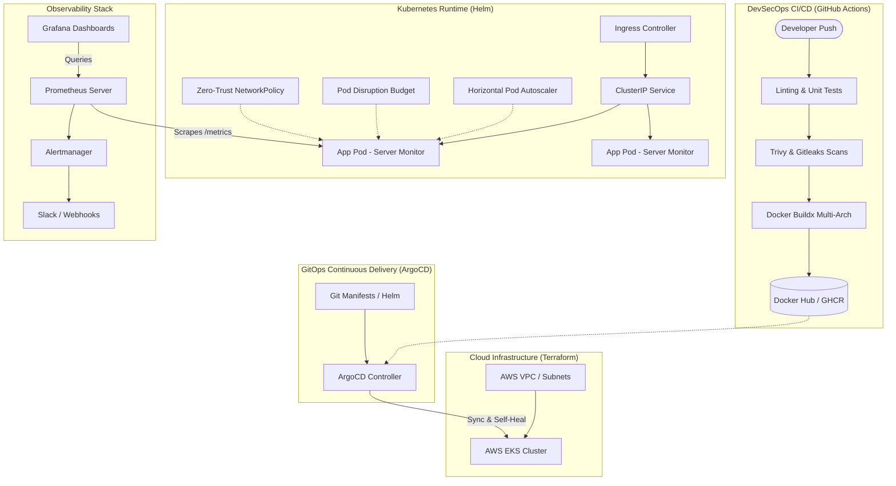

# ⚡ Enterprise DevOps Server Health & Observability Platform

<div align="center">


**A complete, production-grade DevOps engineering platform featuring Real-Time Server Health Monitoring, Prometheus Metrics Exporter, Multi-stage Dockerization, Zero-Trust Kubernetes Helm Deployments, GitOps with ArgoCD, AWS Cloud Infrastructure via Terraform, and Automated DevSecOps CI/CD Pipelines.**

</div>

---

## 📌 Architecture Overview



---

## ✨ Key Enterprise Features

- **Real-Time Health Exporter & Dashboard**:
  - Exposes standard Prometheus metrics (`system_cpu_usage_percent`, `system_memory_usage_percent`, `system_disk_usage_percent`, `system_health_status`, `http_requests_total`).
  - Native Kubernetes liveness (`/healthz`) and readiness (`/readyz`) probes.
  - Interactive dark-mode web dashboard with live auto-refresh at `http://localhost:3000/`.
- **Security-Hardened Docker Containerization**:
  - Multi-stage build targeting minimal Alpine base (`node:20-alpine`).
  - Runs strictly as unprivileged non-root user (`node`).
  - Integrated `dumb-init` for proper Linux signal forwarding and zombie process reaping.
  - Built-in container healthcheck instruction.
- **Full Local Observability Stack (`docker-compose.yml`)**:
  - 1-command local environment with **App**, **Prometheus**, **Grafana** (pre-provisioned dashboards), and **Alertmanager**.
- **Production Kubernetes Helm Chart (`helm/devops-monitor`)**:
  - High Availability with **HorizontalPodAutoscaler (HPA)** and **PodDisruptionBudget (PDB)**.
  - TLS-ready Ingress configuration.
  - Prometheus Operator `ServiceMonitor` integration.
  - Zero-Trust `NetworkPolicy` restricting unauthorized ingress/egress.
  - Multi-environment values (`values-dev.yaml`, `values-prod.yaml`).
- **GitOps Continuous Delivery**:
  - Declarative **ArgoCD Application manifests** with automated sync, prune, and self-healing.
  - **App-of-Apps** pattern for enterprise multi-cluster management.
- **Infrastructure as Code with Terraform (`terraform/`)**:
  - Modular AWS architecture (`modules/vpc`, `modules/eks`).
  - Separate `dev` and `prod` environments.
  - Remote state locking with AWS S3 + DynamoDB.
- **DevSecOps Automated CI Pipeline (`.github/workflows/ci.yml`)**:
  - ShellCheck validation on bash scripts.
  - Automated unit testing.
  - **Gitleaks** credential leak detection.
  - **Trivy** vulnerability scanner for dependencies and container images.
  - Multi-architecture Docker builds (`linux/amd64`, `linux/arm64`) using Docker Buildx and GitHub caching.

---

## 📂 Project Structure

```text
devops-projectfirst/
├── .github/
│   └── workflows/
│       └── ci.yml                 # DevSecOps CI: Tests, ShellCheck, Trivy, Gitleaks, Buildx
├── src/
│   ├── app.js                     # Core Express server & health probe routes
│   ├── metrics.js                 # Prometheus registry & system metrics collector
│   ├── systemInfo.js              # Real-time CPU, Memory, Disk & Process metrics
│   └── public/
│       └── index.html             # Real-time Glassmorphism Web Dashboard UI
├── tests/
│   └── app.test.js                # Automated unit test suite (Node test runner)
├── docker-compose.yml             # Full local stack (App + Prometheus + Grafana + Alertmanager)
├── Dockerfile                     # Multi-stage non-root hardened container
├── .dockerignore                  # Clean build context
├── helm/
│   └── devops-monitor/            # Production Helm Chart
│       ├── Chart.yaml
│       ├── values.yaml            # Base values
│       ├── values-dev.yaml        # Dev overrides
│       ├── values-prod.yaml       # Prod overrides (HA, 3+ replicas)
│       └── templates/             # Deployment, Service, HPA, PDB, Ingress, NetworkPolicy
├── gitops/
│   └── argocd/                    # Declarative ArgoCD GitOps manifests
│       ├── application-dev.yaml
│       ├── application-prod.yaml
│       └── app-of-apps.yaml
├── terraform/
│   ├── modules/
│   │   ├── vpc/                   # Public/Private subnets, NAT, IGW
│   │   └── eks/                   # EKS Cluster, Managed Node Groups, IAM Roles
│   └── environments/
│       ├── dev/                   # Dev environment deployment
│       └── prod/                  # Prod environment deployment
├── monitoring/
│   ├── prometheus/
│   │   ├── prometheus.yml         # Scrape jobs
│   │   └── alert.rules.yml        # High CPU/Mem/Disk alerting rules
│   ├── alertmanager/
│   │   └── alertmanager.yml       # Routing & Slack/Webhook notifications
│   └── grafana/
│       ├── provisioning/          # Automated datasource & dashboard provisioning
│       └── dashboards/            # Pre-built Server Metrics Dashboard
├── server_health_check.sh         # Linux bash health check script
├── alert_on_failure.sh            # Bash alerting engine (Slack & Email)
├── setup_cron_monitoring.sh       # Cron scheduler installer
├── package.json
└── README.md
```

---

## 🚀 Quick Start Guide

### 1. Run Locally with Node.js
```bash
# Install dependencies
npm install

# Run unit tests
npm test

# Start the application
npm start
```
- Open Web Dashboard: [http://localhost:3000](http://localhost:3000)
- View Prometheus Metrics: [http://localhost:3000/metrics](http://localhost:3000/metrics)
- Check Health API: [http://localhost:3000/api/v1/health](http://localhost:3000/api/v1/health)

---

### 2. Run the Full Observability Stack with Docker Compose
To run the server monitor alongside Prometheus, Grafana, and Alertmanager with a single command:

```bash
docker compose up -d
```

| Service | URL | Default Credentials | Description |
| :--- | :--- | :--- | :--- |
| **Server Health Dashboard** | [http://localhost:3000](http://localhost:3000) | None | Live system health UI |
| **Prometheus** | [http://localhost:9090](http://localhost:9090) | None | Metrics browser & target status |
| **Grafana** | [http://localhost:3001](http://localhost:3001) | `admin` / `admin` | Auto-provisioned visual dashboard |
| **Alertmanager** | [http://localhost:9093](http://localhost:9093) | None | Alert trigger & routing engine |

---

## ☸️ Kubernetes Deployment via Helm

### Deploy to Development
```bash
helm upgrade --install devops-monitor ./helm/devops-monitor \
  -n dev --create-namespace \
  -f ./helm/devops-monitor/values.yaml \
  -f ./helm/devops-monitor/values-dev.yaml
```

### Deploy to Production
```bash
helm upgrade --install devops-monitor ./helm/devops-monitor \
  -n prod --create-namespace \
  -f ./helm/devops-monitor/values.yaml \
  -f ./helm/devops-monitor/values-prod.yaml
```

---

## 🐙 GitOps with ArgoCD

Apply the declarative Application manifests to your ArgoCD cluster:

```bash
# Deploy dev environment via GitOps
kubectl apply -f gitops/argocd/application-dev.yaml

# Deploy prod environment via GitOps
kubectl apply -f gitops/argocd/application-prod.yaml

# Or apply the App-of-Apps master manifest
kubectl apply -f gitops/argocd/app-of-apps.yaml
```

ArgoCD will automatically reconcile and maintain the desired state defined in this repository, rolling out updates whenever changes are pushed to `main`.

---

## 🏗️ Cloud Infrastructure with Terraform

Provision AWS VPC and EKS infrastructure using the included modules:

```bash
cd terraform/environments/dev

# Initialize Terraform providers and backend
terraform init

# Validate configuration
terraform validate

# Plan and inspect infrastructure changes
terraform plan

# Apply infrastructure
terraform apply
```

---

## 🛡️ DevSecOps Pipeline Summary

Whenever code is pushed or a Pull Request is opened:
1. **Quality Gate**: Node.js unit tests and ShellCheck on bash automation scripts.
2. **Security Gate**:
   - **Gitleaks**: Audits repository commits to prevent secret/token exposure.
   - **Trivy Filesystem**: Identifies known vulnerabilities (CVEs) in third-party packages.
   - **Trivy Image**: Performs vulnerability analysis on the compiled container.
3. **Build & Release Gate**:
   - Docker Buildx produces multi-platform images (`linux/amd64`, `linux/arm64`).
   - Images are tagged with Git commit SHA and `latest`, then pushed to Docker Hub / GHCR.

---

## 📜 Authors & License

- **Author**: Muhammad Adeel
- **License**: MIT
